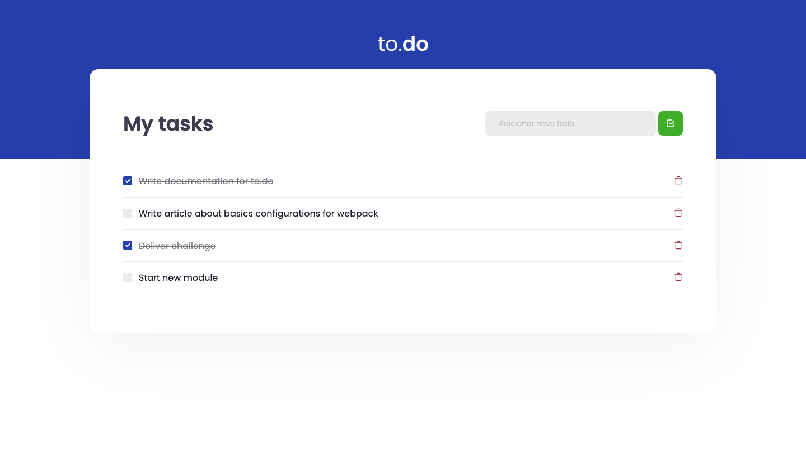

  

	
  

# 📖 About

This application is the first challenge from the [Ignite Bootcamp](https://rocketseat.com.br/ignite). The objetive is to develop the CRUD functions of this app.

# 📐 Layout

  

    
  

### 🚀 Tecnologies

- React.js
- Typescript
- SCSS
- HTML

# 🔧 How to run

- Download this project to your computer or use the git command `git clone git@github.com:igorfiquene/todo-list-ignite.git`
- Open the folder todo-list-ignite in your system's shell
- Run `$ yarn install` to install the project's modules

### Webpage

- Open the folder todo-list-ignite in a terminal tab
- Run `$ yarn dev`

# :closed_book: License

Released in 2021 :closed_book: License

This project is under the [MIT license](./LICENSE).

Give a ⭐️ if this project helped you!

#

   <b> &#60;/&#62; by <a href="https://www.linkedin.com/in/igor-fiquene/">Igor Fiquene Pessoa</a></b>

